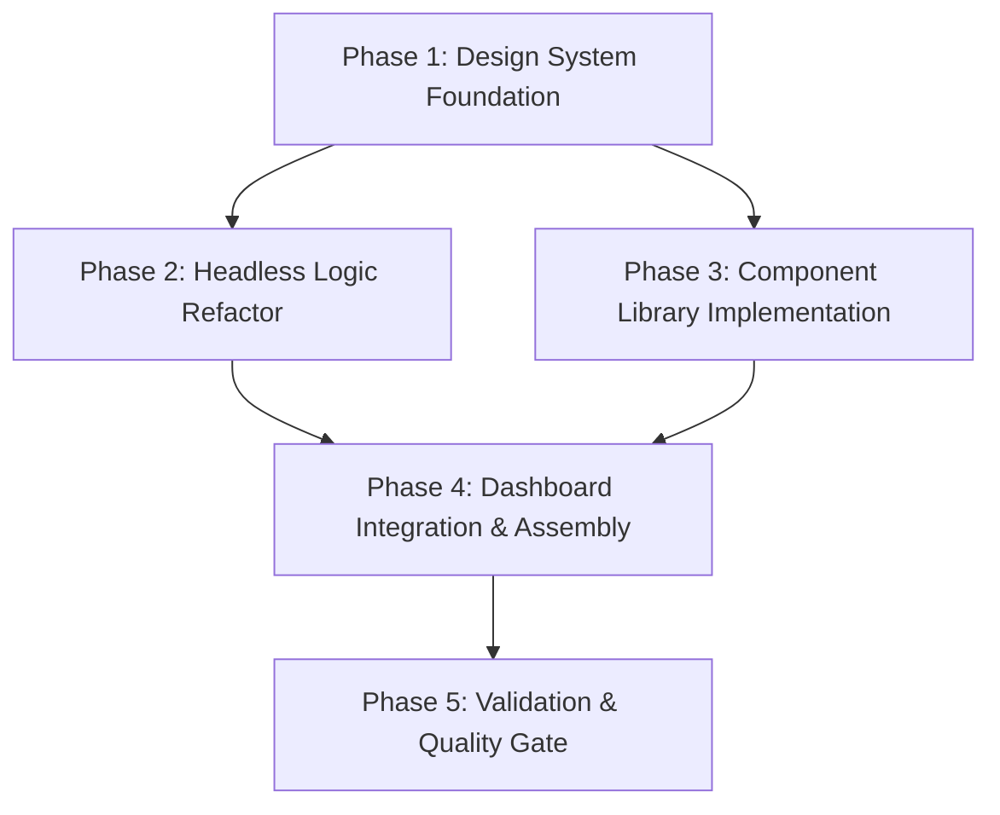

# Implementation Plan: Dashboard Redesign & Componentization

## 1. Plan Overview
This plan decomposes the Dashboard redesign into 5 phases, focusing on **SOLID principles** and **Vercel React best practices** for composition. We will use a **Compound Component** pattern to build a flexible, logic-free UI bound to a headless hook.

- **Total Phases**: 5
- **Agents Involved**: `design_system_engineer`, `coder`, `code_reviewer`
- **Estimated Effort**: ~12-16 agent turns

## 2. Dependency Graph

## 3. Execution Strategy

| Stage | Phases | Agent(s) | Execution Mode |
|-------|--------|----------|----------------|
| 1 | Phase 1 | `design_system_engineer` | Sequential |
| 2 | Phase 2, 3 | `coder` | Parallel |
| 3 | Phase 4 | `coder` | Sequential |
| 4 | Phase 5 | `code_reviewer` | Sequential |

## 4. Phase Details

### Phase 1: Design System Foundation
- **Objective**: Setup Tailwind CSS and configure the custom design tokens from `template.html`.
- **Agent**: `design_system_engineer`
- **Files to Create**:
    - `front/tailwind.config.ts`: Custom theme (colors: surface, primary, secondary; fonts: Space Grotesk, Inter, JetBrains Mono; animations: scanning-line, scan).
    - `front/postcss.config.js`: Tailwind & Autoprefixer setup.
- **Files to Modify**:
    - `front/src/index.css`: Add Tailwind directives (@tailwind base, etc.) and global keyframes.
    - `front/package.json`: Add `tailwindcss`, `postcss`, and `autoprefixer` dependencies.
- **Validation**: `npm run dev` (ensure Tailwind loads), `npm run build` (check for compilation errors).
- **Dependencies**: None.

### Phase 2: Headless Logic Refactor (Parallel-Eligible)
- **Objective**: Refactor `usePeritaje.ts` into a clean headless hook that manages analysis status, results, and logs.
- **Agent**: `coder`
- **Files to Modify**:
    - `front/src/hooks/usePeritaje.ts`: Standardize `useMutation` hook. Ensure it provides `isAnalyzing`, `results`, `logs`, and `startAnalysis()`.
    - `front/src/services/forensicService.ts`: Verify API interaction matches the hook's requirements.
- **Validation**: Unit test `usePeritaje.ts` (if test infra exists) or verify via a temporary test component.
- **Dependencies**: Phase 1.

### Phase 3: Component Library Implementation (Parallel-Eligible)
- **Objective**: Implement 11+ presentational compound components following SOLID principles.
- **Agent**: `coder`
- **Files to Create**:
    - `front/src/components/Dashboard/Dashboard.tsx`: Main layout container with compound component namespace.
    - `front/src/components/Dashboard/DashboardHeader.tsx`: Title and AI Status.
    - `front/src/components/Dashboard/DashboardGrid.tsx`: Bento Grid layout.
    - `front/src/components/Dashboard/ArtifactSlot.tsx`: Image upload/scanning UI.
    - `front/src/components/Dashboard/VerdictCard.tsx`: Result display and confidence linear progress.
    - `front/src/components/Dashboard/TerminalLog.tsx`: Scrollable log stream.
- **Files to Modify**:
    - `front/src/components/Dashboard/index.ts`: Export the compound components.
- **Validation**: `npm run lint`, manual UI verification in a Storybook-like dev page or temporary route.
- **Dependencies**: Phase 1.

### Phase 4: Dashboard Integration & Assembly
- **Objective**: Refactor `ForensicDashboard.tsx` to compose the new components and bind the refactored hook.
- **Agent**: `coder`
- **Files to Modify**:
    - `front/src/components/Dashboard/ForensicDashboard.tsx`: Complete rewrite using the Compound Pattern: `<Dashboard><Dashboard.Header /><Dashboard.Grid /></Dashboard>`.
    - `front/src/App.tsx`: Update entry point if necessary.
- **Validation**: `npm run dev` (full functional test of upload, scanning, and verdict).
- **Dependencies**: Phase 2, Phase 3.

### Phase 5: Validation & Quality Gate
- **Objective**: Final code review and performance audit.
- **Agent**: `code_reviewer`
- **Files to Modify**: None (Review only).
- **Validation**: Ensure SOLID compliance, check accessibility (ARIA labels), and verify animation performance.
- **Dependencies**: Phase 4.

## 5. File Inventory

| Phase | Path | Action | Purpose |
|-------|------|--------|---------|
| 1 | `front/tailwind.config.ts` | Create | Design system configuration. |
| 1 | `front/package.json` | Modify | UI dependencies. |
| 2 | `front/src/hooks/usePeritaje.ts` | Modify | Headless logic refactor. |
| 3 | `front/src/components/Dashboard/Dashboard.tsx` | Create | Layout and theme container. |
| 3 | `front/src/components/Dashboard/ArtifactSlot.tsx` | Create | Individual scanning slots. |
| 3 | `front/src/components/Dashboard/VerdictCard.tsx` | Create | Analysis result card. |
| 4 | `front/src/components/Dashboard/ForensicDashboard.tsx` | Modify | Final assembly and state binding. |

## 6. Risk Classification

- **Phase 1 (Low)**: Standard tooling setup.
- **Phase 2 (Medium)**: Complex state transitions in the hook refactor.
- **Phase 3 (Medium)**: High volume of UI components; risk of design inconsistency.
- **Phase 4 (Medium)**: Integration of multiple moving parts (hook + compound components).

## 7. Execution Profile

- **Total phases**: 5
- **Parallelizable phases**: 2 (Phase 2 and Phase 3 in 1 batch)
- **Sequential-only phases**: 3
- **Estimated parallel wall time**: ~8-10 turns
- **Estimated sequential wall time**: ~12-16 turns

## 8. Cost Estimation

| Phase | Agent | Model | Est. Input | Est. Output | Est. Cost |
|-------|-------|-------|-----------|------------|----------|
| 1 | `design_system_engineer` | Pro | 2,500 | 500 | $0.05 |
| 2 | `coder` | Pro | 3,000 | 800 | $0.07 |
| 3 | `coder` | Pro | 5,000 | 1,500 | $0.12 |
| 4 | `coder` | Pro | 4,000 | 1,000 | $0.09 |
| 5 | `code_reviewer` | Pro | 6,000 | 500 | $0.08 |
| **Total** | | | **20,500** | **4,300** | **$0.41** |
